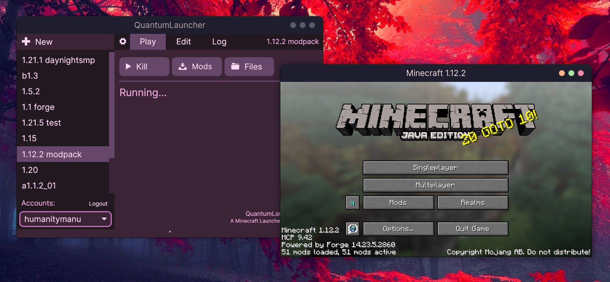
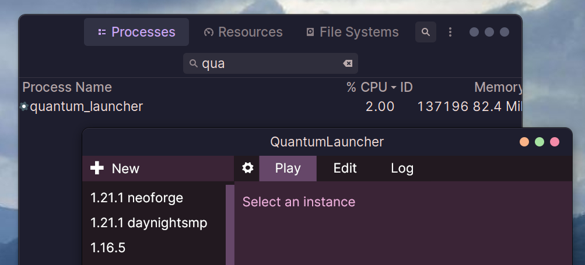
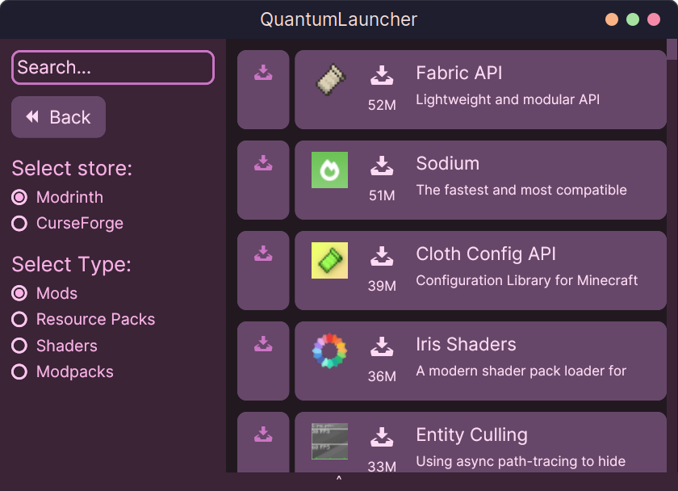
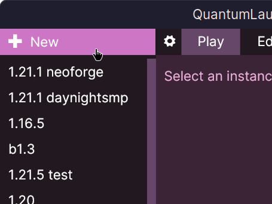
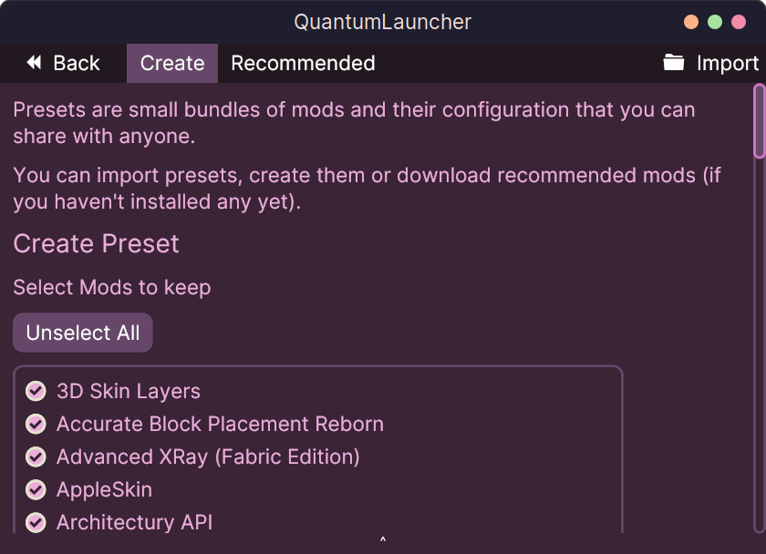
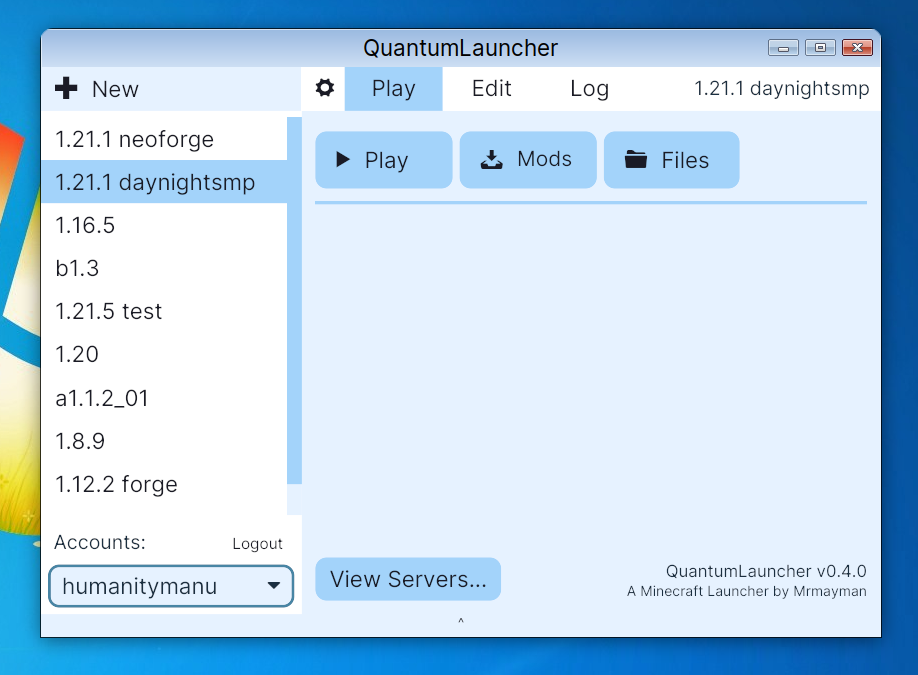

# QuantumLauncher
A minimalistic Minecraft launcher for Windows and Linux (and soon-to-be macOS).



- Website (+ Download): https://mrmayman.github.io/quantumlauncher

- Discord: https://discord.gg/bWqRaSXar5

QuantumLauncher is written in *Rust* with the *iced* framework,
offering a lightweight and responsive experience.
It is designed to be simple and easy to use, with a focus on performance and features.

# Features
- Lightweight and responsive. No more minute-long loading screens, no more laggy buttons



- Install fabric, forge or optifine with ease


- Build in mod store to download your favorite mods



- Isolate your different game versions with instances!



- Full support for old minecraft versions, integrated with Omniarchive. Includes skin and sound fixes!


- Neatly package your mods into presets, and share it with your friends!



- Built in themes!



# Downloads and Building
- You can download the stable version from the website linked above, or from the *Releases*
- Or, you can compile the launcher to get the latest experimental version (with potentially broken and untested features).
- To compile the launcher:
```
git clone https://github.com/Mrmayman/quantum-launcher.git
cd quantum-launcher
cargo run --release
```
You can omit the `--release` flag for faster compile times, but *slightly* worse performance and MUCH larger build file size.

# File Locations
- On *Windows*, the launcher files are at `C:/Users/YOUR_USERNAME/AppData/Roaming/QuantumLauncher/`.
- You probably won't see the `AppData` folder. Press Windows + R and paste this path, and hit enter.
- On *Linux*, the launcher files are at `~/.config/QuantumLauncher/`. (`~` refers to your home directory).
- Instances located at `QuantumLauncher/instances/YOUR_INSTANCE/`
- `.minecraft` located at `YOUR_INSTANCE/.minecraft/`.
- Launcher logs are located at `QuantumLauncher/logs/`.

# To-do (in the future)
## Core
- [x] Instance creation
- [x] Instance launching
- [x] Instance deletion
- [ ] Instance renaming
- [x] Java/Game args editing
- [x] Memory allocation editing
- [ ] Optional Microsoft login
## Mods
### Loaders
- [x] Fabric
- [x] Forge
- [x] Optifine
- [x] Quilt
- [ ] Neoforge
- [ ] OptiForge
- [ ] OptiFabric
- [ ] Jar Mods
### Sources
- [x] Modrinth mods
- [ ] Curseforge mods
- [ ] Modrinth modpacks
- [ ] Curseforge modpacks
### Features
- [x] Mod store
- [x] Mod updater
- [x] Mod presets
## Platforms
- [x] Windows x86_64
- [x] Linux x86_64
- [ ] Linux Aarch64
- [ ] macOS
- [ ] Android (distant future)
## Misc
- [x] Integration with Omniarchive, old version support
- [ ] A local server hosting system (without port forwarding, using proxy tunneling).
- [ ] Plugin system (with WASM)

# Licensing and Credits
A lot of this launcher's design, including the code for creating and launching the game, and installing forge, is inspired by https://github.com/alexivkin/minecraft-launcher/.

Nearly all of this launcher is licensed under the GNU General Public License v3,
however there are a few exceptions (such as github actions and assets).
Visit [the assets README](assets/README.md) for more information.

# Note on Piracy
If you pirate the game, it's at your own risk. I am not responsible for any issues caused.
I recommend that you buy the game, but if you don't have the means, feel free to use this launcher.
If anyone has any issues/complaints, just open an issue in the repo.
